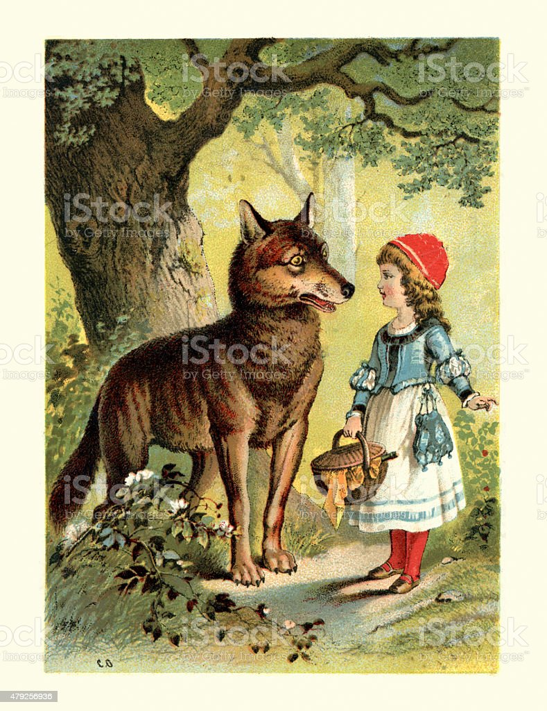
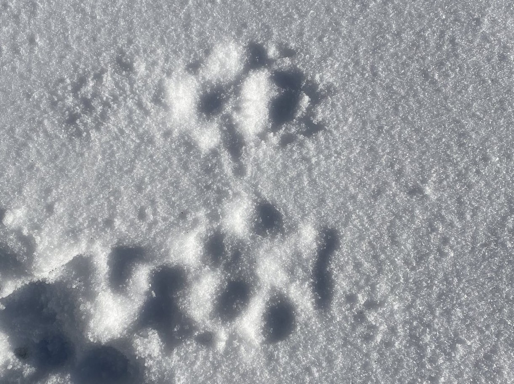

+++
title = "Zurück in Europa"
date = "2023-04-30"
draft = false
pinned = false
image = "2.7.jpg"
description = "Nachdem der Luchs Anfang des 20. Jahrhunderts in Westeuropa ausgerottet wurde, ist er jetzt wieder zurückgekehrt. Diese Rückkehr ist aber nicht ganz so einfach, wie man es sich wünschen würde. Über die Herausforderungen der Wiederansiedlung, das aktuelle Projekt im Dählhölzli und über den Luchs im Allgemeinen wird in dieser Reportage besprochen.\nEine Reportage von Jaël Zurfluh, Bern"
+++
# Der Luchs ist wieder da!

Für gewöhnlich sind Gehege in Zoos gut einsehbar, damit die Besucher gut hineinsehen und die Tiere beobachten können. Dies ist im Moment aber anders beim Luchsgehege des Dählhölzlis. Es wurden Büsche und kleinere Bäume vor den Zaun gepflanzt, die die Sicht auf das Gehege erschweren. Sowieso muss man Glück haben, die Luchse überhaupt mal zu erspähen. Oft wenn man vor dem Gehege steht, läuft vielleicht ab und zu mal ein Jogger oder ein Spaziergänger vorbei, aber von den Luchsen sieht nichts, aber in der Luft liegt ein typisch verräterischer Duft einer Katze, die ihr Revier markiert.

Die beiden Luchse im Gehege sind erst seit Februar hier in Bern, ein Weibchen und ein Männchen. Die beiden Tiere sind Teil eines Projektes, welches zum Ziel hat, den Nachwuchs der beiden Katzen auszuwildern.  Genaueres über das Projekt erzählt mir Kristina Vogt von KORA, und Dina Gebhardt, Zuchtbuchführerin des Eurasischen Luchses. Dina kümmert sich in den europäischen Zoos darum, dass die genetische Vielfalt der Luchse hoch bleibt, indem sie sicher geht, dass in Zoos beispielsweise unter den Tieren keine Inzucht vorkommt. Sie ist also eine Art Verkupplerin für Luchse, erklärt sie mir, während wir im warmen und feuchten Vivarium des Tierparks Bern, in einem Pausenraum für die Mitarbeiter sitzen.

<!--StartFragment-->

``

KORA ist eine Stiftung, die sich mit der Raubtierökologie und Wildtiermanagement in der Schweiz beschäftigt.

``

##### <!--EndFragment-->

## Das Problem der Gene

In der Schweiz gibt es momentan wieder drei beständige, wildlebende Luchspopulationen, in den Alpen, dem Jura und der Nordostschweiz. Diese kamen jedoch nicht von allein wieder zurück. Anders als beispielsweise beim Wolf wurden Luchse aus den Karpaten (Ukraine, Slowakei und Rumänien) aktiv hergebracht und wieder angesiedelt. Das aktuell grösste Problem dieser drei Bestände ist ein genetisches. Die verschiedenen Bestände sind voneinander isoliert, menschliche Hürden wie Autobahnen oder Siedlungsgebiete erschweren den Austausch zwischen den verschiedenen Populationen sehr. Dies führt laut Kristina Vogt seit der Gründung der Population zu einer Abnahme der genetischen Vielfalt und zu einer Zunahme von Inzucht in den drei Regionen. Dasselbe Problem gibt es in fast allen Westeuropäischen Ländern, die den Luchs wieder angesiedelt haben.

## Das Projekt im Dählhölzli

Vogt erklärt mir, dass man diese Situation verbessern möchte und innerhalb eines Netzwerks koordiniert. Verbessern will man die Situation beispielsweise mit gezielten Wiederansiedlungsprojekten, mit denen man versucht, die Lücken zwischen bereits existierenden Populationen zu füllen. Gemäss Vogt «will man den Austausch ankurbeln und auch aktiv Tiere austauschen und an neuen Orten verteilen.». Für dies kämen nicht nur Wildfänge aus beispielsweise der Slowakei in Frage, was eine zu starke Reduktion der Population zur Folge hätte, sondern auch Tiere aus der Zoopopulation, erklärt Vogt weiter. Hier kommt wieder das Projekt im Dählhölzli ins Spiel.

Das aktuelle Geschehen rund um das Luchsgehege im Dählhölzli, ist nämlich genau so ein Wiederansiedlungsprojekt, welches unter anderen von KORA koordiniert wird. Die beiden Luchse wurden auf Grund ihrer Genetik ausgewählt und man hofft auf den genetisch wertvollen Nachwuchs, der dann in Deutschland ausgewildert werden soll. Aber um die Tiere wirklich freilassen zu dürfen, kommen noch einige Hürden auf sie zu.

Bei vielen kommt wohl schnell die Frage auf, wie wahrscheinlich es überhaupt ist, dass die jungen Luchse ausgewildert werden können, sie kommen schliesslich in Gefangenschaft zur Welt. Dina Gebhardt erklärt dazu, dass man das noch nicht sagen könne. Es komme sehr auf ihr späteres Verhalten an. So müsse man Verhaltensprotokolle führen, um zu entscheiden, ob ein Luchs ausgewildert werden darf oder nicht. Ein Faktor ist beispielsweise, ihr Verhalten gegenüber Menschen. Wenn sie keine Scheu vor Menschen haben oder gar frech zu ihnen sind, sei dies ein Zeichen, dass es wahrscheinlich nicht funktionieren werde mit der Auswilderung.

Natürlich gibt es jetzt schon Massnahmen, die diese Ansprüche an das Verhalten der Jungluchse begünstigen sollen. Die erste Massnahme sei nämlich das Gehege selbst, berichtet Dina Gebhardt. Man habe in ganz Europa geschaut, welche Anlagen in Zoos sich überhaupt für die Zucht von Luchsen eignen würden, die ausgewildert werden sollen. Die Anlage müsse gross sein, sowie auch naturnah und die Anlage sollte nicht von mehreren Seiten einsehbar sein. «Einsehbar wäre nicht das Problem, aber solange die Besucher reinsehen können, können die Luchse auch hinausschauen. Also die Luchse sollen wirklich nicht an Menschen gewöhnt werden.» erläutert Gebhardt. Wenn voraussichtlich im Mai die Jungtiere auf die Welt kommen, dürfen auch keine Tierpflegenden mehr in die Anlage, ausser es sei zwingend notwendig. Ab ebenfalls diesem Zeitraum werden die Luchse nur noch mit Wildtieren gefüttert. Der Gedanke dahinter ist, dass die Jungtiere auf Fleisch von wilden Tieren geprägt werden sollen. Wenn sie sich zum Beispiel an Hühnerfleisch gewöhnen würden und später nach ihrer Freilassung Lust auf dieses hätten, wäre die Wahrscheinlichkeit sehr gross, dass sie in Konflikt mit Menschen geraten würden.

Da es eine politische Frage ist, ist es schwer zu sagen, ob so ein Auswilderungsprojekt auch für die Schweiz kommen wird. Vogt meint allerdings «längerfristig müsste man eigentlich aus wissenschaftlicher Sicht auch in der Schweiz frische Luchse freilassen, welche die genetische Situation verbessern könnten. Obwohl sich der Bestand gut entwickelt, sind Luchse immer noch geschützt und längerfristig kann die genetische Situation der Tiere schon ein Problem werden».

## Die Geschichte des Luchses

Dass der Luchs heute in dieser Lage steckt, hat er uns Menschen zu verdanken. Interessanterweise nimmt der Luchs im Vergleich zum Wolf und Bären kulturhistorisch nur eine Nebenrolle ein. Der Luchs kommt beispielsweise viel seltener in Märchen, Sagen und Mythen vor als der Wolf. Dies war aber für den Luchs immer eher positiv, da die Sichtweise der Menschen ihm gegenüber weniger kulturell geprägt war. In der Jagdliteratur wird der Luchs oft als Konkurrent des Jägers angesehen, aber auch als eine gute Beute.

Hauptursache für die Ausrottung des Luchses war, dass Raubtieren wie dem Luchs ganz generell Eigenschaften wie Mordlust und Blutdurst zugeschrieben wurden und es bis in das 19. Jahrhundert als Christenpflicht angesehen wurde, diese zu jagen und zu bekämpfen. Diese Motivation wurde durch Abschussprämien noch erhöht. Dazu beigetragen hat auch noch der Rückgang der Waldfläche und der Beutetiere.  

Heute hat sich die Einstellung Wildtieren gegenüber verändert, Raubtiere zum Beispiel werden normalerweise nicht mehr als blutrünstige Kreaturen angesehen. Was aber geblieben ist, ist die Konkurrenz von Luchsen gegenüber den Jägern. Ein Luchs frisst etwa ein Reh pro Woche. In einem Gebiet, in dem die Luchse den Bestand der Rehe usw. regulieren, dürfen Jäger nicht mehr jagen. Dies ist laut einer Umfrage in Tschechien der Hauptgrund für die Wilderei an Luchsen. Der zweithäufigste Grund sei der Trophäenstatus, welchen ein Luchs und sein Pelz haben.

Auch Kristina Vogt sagt: «Ja Wilderei gibt es nach wie vor. Nicht nur in der Schweiz, sondern auch an anderen Orten.». Es sei aber schwierig zu sagen, in welchem Ausmass dies stattfinde. Feststeht, dass der Luchs ein geschütztes Tier ist und nur in seltenen und speziellen Fällen eine Abschussbewilligung ausgestellt wird.

## Direkter Einfluss auf uns

Wie man bereits aus der Erzählung am Anfang schliessen kann, ist es sogar im Zoo sehr schwer einen Luchs zu erspähen. Obwohl er mittlerweile sogar in Regionen lebt, die nah von dichtbesiedelten Gebieten sind wie Bern, wird es schwierig sein eine der Pinselohren zu Gesicht zu bekommen in freier Natur. Trotzdem sollte man immer die Augen offenhalten, wenn man im Wald unterwegs ist, besonders in den Wintermonaten hat man die Chance Spuren im Schnee entdecken zu können. Auch ein Indiz kann der Geruch der Tiere sein, wenn man einer Stelle vorbeikommt, wo der Luchs sein Revier markiert hat. 

Angst muss man vor der grössten Wildkatze der Schweiz gottseidank nicht haben, Luchse halten sich stehts eher zurück. Auch Vorfälle mit Nutztieren sind bei Luchsen eher eine Seltenheit. Ein toller Fact, den Dina nach dem Interview noch erwähnt hat, war, dass in der Schweiz die meisten Leute noch nie einen Luchs gesehen haben aber wahrscheinlich schon mal von einem Luchs beobachtet wurden.