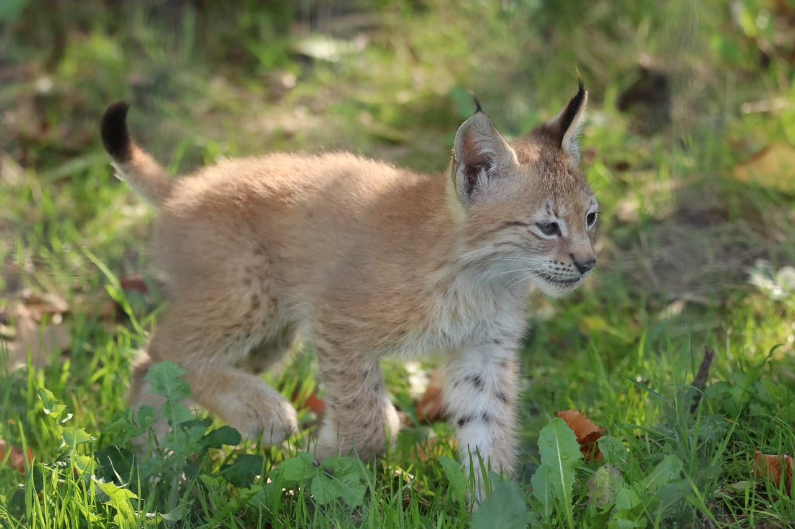

+++
title = "Zurück in Europa"
date = "2023-03-25"
draft = false
pinned = false
+++
# Zurück in Europa

## Der Luchs ist wieder da!

**Nachdem der Luchs Anfang des 20. Jahrhunderts in Westeuropa ausgerottet wurde, kehrt er jetzt wieder zurück. Diese Rückkehr ist aber nicht ganz so einfach wie man sich es wünscht. Über die Herausforderungen der Wiederansiedlung, das aktuelle Projekt im Dählhölzli und über den Luchs im Allgemeinen werde ich in dieser Reportage sprechen.**

Eine Reportage von Jaël Zurfluh, Bern

Für gewöhnlich sind Gehege in Zoos gut einsehbar damit die Besucher gut rein sehen und die Tiere beobachten können. Dies ist im Moment aber anders beim Luchsgehege des Dählhölzlis, es wurden Büsche und kleinere Bäume vor den Zaun gepflanzt, die die Sicht auf das Gehege erschweren. Sowieso muss man Glück haben die Luchse überhaupt mal zu erspähen. Als ich vor dem Gehege stehe läuft ab und zu ein Jogger oder ein Spaziergänger vorbei, aber von den Luchsen sehe ich keine Spur, ausser dem typisch verräterischen Duft einer Katze, die ihr Revier markiert.

Die beiden Luchse im Gehege sind erst seit einigen Wochen hier, ein Weibchen und ein Männchen. Die beiden Tiere sind Teil eines Projektes, welches das Ziel hat, den Nachwuchs der beiden Tiere auszuwildern. Um genaueres über das Projekt zu erfahren, telefoniere ich mit Kristina Vogt von KORA (KORA koordiniert das aktuelle Projekt) und treffe mich mit Dina Gebhardt, Zuchtbuchführerin des Eurasischen Luchses. Dina kümmert sich in den europäischen Zoos darum, dass die genetische Vielfalt der Luchse hoch bleibt, in dem sie sicher geht, dass in Zoos beispielsweise unter den Tieren keine Inzucht vorkommt. Sie ist also eine Art Verkupplerin für Luchse, erklärt sie mir.

### Das Problem der Genetik

In der Schweiz gibt es momentan wieder drei beständige, wildlebende Luchspopulationen, in den Alpen, dem Jura und der Nordostschweiz. Diese kamen jedoch nicht von allein wieder zurück, anders als beispielsweise beim Wolf, wurden Luchse aus den Karpaten (Ukraine, Slowakei und Rumänien) aktiv hergebracht und wieder angesiedelt. Das aktuell grösste Problem dieser drei Bestände ist ein Genetisches. Die verschiedenen Bestände sind voneinander isoliert, menschliche Hürden wie Autobahnen oder Siedlungsgebiete machen einen Austausch zwischen den verschiedenen Populationen sehr schwer. Dies führt \[laut Kristina Vogt] seit der Gründung der Population zu einer Abnahme der genetischen Vielfalt und zu einer Zunahme von Inzucht in den drei Regionen. Dasselbe Problem gibt es in fast allen Westeuropäischen Ländern, die den Luchs wieder angesiedelt haben.

### Das Projekt im Dählhölzli

Vogt erklärt mir, dass man diese Situation verbessern möchte und innerhalb eines Netzwerks koordiniert. Verbessern will man die Situation beispielsweise mit gezielten Wiederansiedlungsprojekten, mit denen man versucht die Lücken zwischen bereits existierenden Populationen zu fühlen. Gemäss Vogt «will man den Austausch ankurbeln und auch aktiv Tiere austauschen und verteilen an neuen Orten.». Für dies kämen nicht nur Wildfänge aus beispielsweise der Slowakei in Frage, da sonst diese Population zu stark reduziert werde, sondern auch Tiere aus der Zoopopulation, erklärt Vogt weiter. Hier kommt wieder das Projekt im Dählhölzli ins Spiel.

Das aktuelle Geschehen rund um das Luchsgehege im Dählhölzli, ist nämlich genau so ein Wiederansiedlungsprojekt, welches unteranderen von KORA koordiniert wird. Die beiden Luchse wurden auf Grund ihrer Genetik ausgewählt und man hofft auf den genetischwertvollen Nachwuchs, der dann in Deutschland ausgewildert werden soll. Um die Tiere dann freilassen zu dürfen, kommen aber noch einige Hürden auf sie zu.

Bei vielen kommt wohl schnell die Frage auf wie wahrscheinlich es überhaupt ist, ob die jungen Luchse ausgewildert werden können, sie kommen schliesslich in Gefangenschaft zur Welt. Dina Gebhardt erklärt dazu, dass man es noch nicht sagen könne, es komme sehr auf ihr späteres Verhalten an, man müsse Verhaltensprotokolle durchführen um zu entscheiden ob ein Luchs ausgewildert werden darf oder nicht. Beispielsweise wie sie sich gegenüber Menschen verhalten, wenn sie keine Scheue vor Menschen haben oder gar frech zu ihnen sind, sei dies ein Zeichen, dass es wahrscheinlich nicht funktionieren werde mit der Auswilderung.

Natürlich gibt es jetzt schon Massnahmen, die diese Ansprüche an das Verhalten der Jungluchse vergünstigen sollten. Die erste Massnahme sei nämlich das Gehege selbst, berichtet Dina Gebhardt. Man habe in ganz Europa geschaut welche Anlagen in Zoos sich überhaupt eignen würden für die Zucht von Luchsen, die ausgewildert werden sollten. Die Anlage müsse gross sein sowie auch naturnahe und die Anlage solle nicht von mehreren Seiten einsehbar sein. Gebhardt erläutert «Einsehbar wäre nicht das Problem, aber solange die Besucher reinsehen können, können die Luchse auch Rausschauen. Also die Luchse sollen wirklich nicht an Menschen gewöhnt werden.». Wenn voraussichtlich im Mai die Jungtiere kommen dürfen auch keine Tierpflegenden mehr in die Anlage, nur wenn es absolut notwendig sei. Ab ebenfalls diesem Zeitraum werden die Luchse nur noch mit Wildtieren gefüttert. Der Gedanke dahinter ist, dass die Jungtiere auf Fleisch von wilden Tieren geprägt werden sollen. Wenn sie sich zum Beispiel an Hühnerfleisch gewöhnen würden und später nach ihrer Freilassung Lust auf dieses hätten, ist die Wahrscheinlichkeit sehr gross, dass sie in Konflikt mit den Menschen geraten würden.

Da es eine politische Frage ist, ist es schwer zu sagen ob so ein Auswilderungsprojekt auch für die Schweiz kommen wird, Vogt meint allerdings «Längerfristig müsste man eigentlich aus wissenschaftlicher Sicht auch in der Schweiz mal frische Luchse freilassen, welche die genetische Situation verbessern könnten.». Obwohl der Bestand sich gut entwickle, sind Luchse immer noch geschützt und längerfristig könne die genetische Situation der Tiere schon ein Problem werden fügt Vogt an.